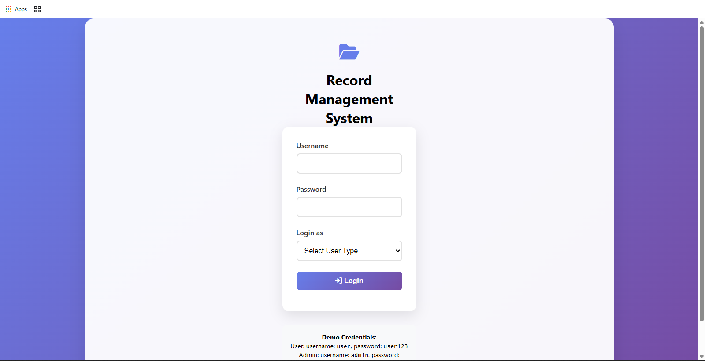

# 📁 Record Management System



A comprehensive web-based Record Management System with role-based access control built with modern web technologies.

## 🚀 Features

### 🔒 Authentication & Authorization
- 👨‍💻 Admin and 👩‍💼 User roles with different permissions
- 🔐 Secure login with role verification
- 🚫 Automatic redirection for unauthorized access

### 📋 Record Management
- ➕ Add new records with categories
- 👁️ View all records in organized tables
- ✏️ Edit existing records
- 🗑️ Delete records (with confirmation)
- 🏷️ Categorize records (Document, Report, Invoice, etc.)
- ⚠️ Status tracking (Active, Pending)

### 👥 User Management (Admin Only)
- ➕ Add new users
- 👁️ View all users
- ✏️ Edit user details
- 🗑️ Delete users (with confirmation)
- 🏷️ Role assignment (Admin/User)

### 📊 Dashboard Analytics
- 📈 Record statistics
- 👥 User statistics (Admin only)
- ⏱️ Recent activity tracking

### 🎨 UI/UX
- 📱 Fully responsive design
- 🎨 Modern, clean interface
- 🔄 Dynamic content loading
- 🎯 User-friendly modals for actions

## 🛠️ Installation

```bash
# Clone the repository
git clone https://github.com/yourusername/record-management-system.git

# Navigate to project directory
cd record-management-system

# Open in browser (no server required)
open index.html
```
